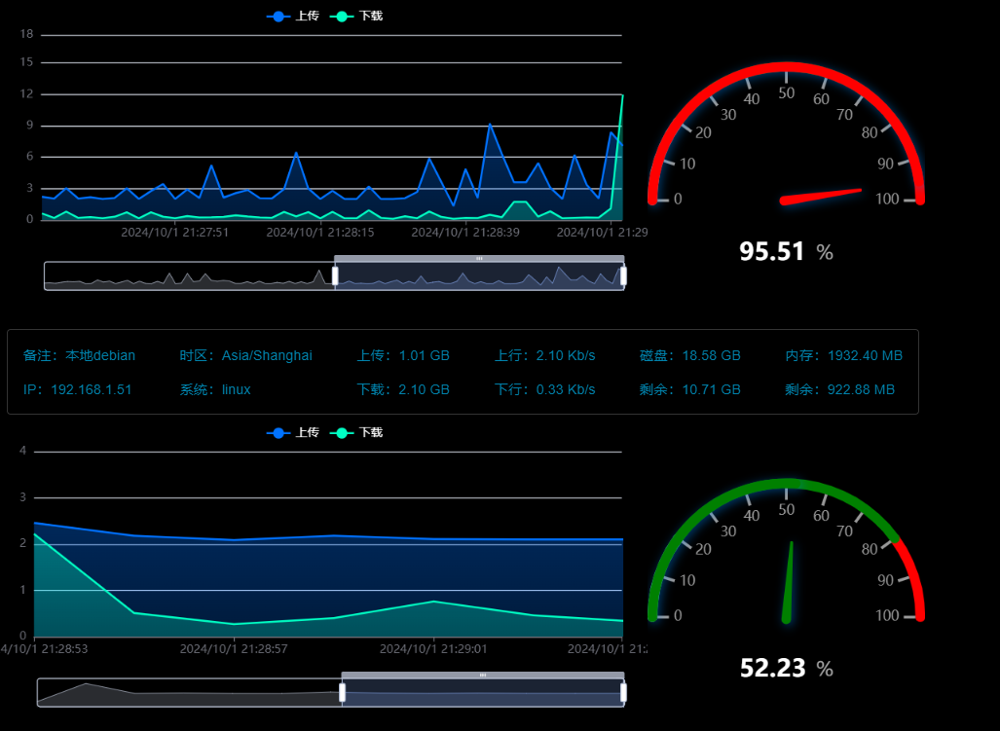

# 监控服务器
本项目需要使用nodejs
可以当作大屏项目部署使用

```bash
nodejs v20.10.0
npm v10.2.3
pm2 v5.4.2
```

分为两个项目：

1. 监控服务器
2. 监控客户端

## 服务器端(默认端口12345)：

### 1.1 安装依赖

```bash
npm install
```

### 1.2 打包项目

```bash
npm install pkg -g
pkg .
```

### 1.3 将打包后的文件放到服务器上，运行

```bash
cd 文件目录
chmod +x 文件名
```
#### 测试是否正常使用

```bash
./文件名
```
没有报错即可进入后续步骤

### 1.4 创建自启服务器

创建自启文件

```bash
sudo vi /etc/systemd/system/network-monitor.service
```
插入以下内容
```bash
[Service]
ExecStart=/usr/node-socket/linux-node-1s
WorkingDirectory=/usr/node-socket
Restart=always
User=root
Environment=PATH=/usr/bin:/usr/local/bin
Environment=NODE_ENV=production
StandardOutput=syslog
StandardError=syslog
SyslogIdentifier=network-monitor
```
```bash
重启系统服务
sudo systemctl enable network-monitor.service
然后启动监控服务
sudo systemctl start network-monitor.service
查看启动状态
sudo systemctl status network-monitor.service
停止服务
sudo systemctl stop network-monitor.service
```

## 客户端：
### 2.0 导入数据库sql文件


### 2.1 安装依赖

```bash
npm install
```

### 2.2 运行项目
首先配置好你的数据库
在utils/config.js中配置

```bash
npm run start
```
在你主服务器或者本地访问 

```bash
    http://服务器ip:3000/echart2
或者
    http://localhost:3000/echart2

添加服务器(需要先部署服务器端，端口默认是12345，如果修改了端口，需要在这里也修改)
    http://localhost:3000/add
```

需要持续运行，可以使用pm2守护进程

```bash
安装pm2管理器
npm install pm2 -g
创建PM2项目
pm2 start ./bin/www --name "monitor"
查看运行状态
pm2 status monitor
```

### 运行界面



